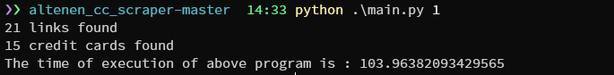

# Altenen.is Credit Card Scraper
This is a simple script to scrape credit card numbers from Altenen.is , just 16 digits numbers.
Then you can report this numbers  as leaked credit card numbers.
It's just scraping https://altenens.is/forums/accounts-and-database-dumps.45/ this page which they expose free cc numbers.


## Usage
* Export [Cookie Editor extension](https://chromewebstore.google.com/detail/cookie-editor/hlkenndednhfkekhgcdicdfddnkalmdm?hl=en-US&utm_source=ext_sidebar) as "Header String" than save it in a file called .env
* then you can run the script, and it will scrape the numbers and save them in a file called "cc.txt" .
* 
* `python main.py {page_number}` , how many page do you want to scrape. it will scrape from the first page to the page you entered.

## Requirements

* tor gateway ( if you want to use tor service enable it in the code )
  * `proxy = '127.0.0.1:9050'`
  * `options.add_argument('--proxy-server=socks5://' + proxy)` 
* `pip3 install -r requirements.txt`

### For Tor Service , I use this

```text
For Windows and Mac: https://github.com/jeremy-jr-benthum/onion-browser-button/releases you can use this.
```