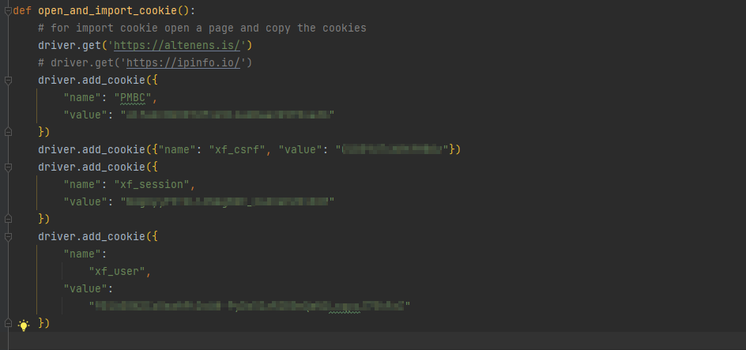
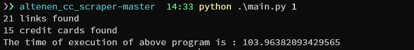

# Altenen.is Credit Card Scraper
This is a simple script to scrape credit card numbers from Altenen.is , just 16 digits numbers.
Then you can report this numbers  as leaked credit card numbers.
It's just scraping https://altenens.is/forums/accounts-and-database-dumps.45/ this page which they expose free cc numbers.


## Usage
* you need to import your cookies from your browser to the script.
*  like this .
* then you can run the script, and it will scrape the numbers and save them in a file called "cc.txt" .
* 
* `python main.py {page_number}` , how many page do you want to scrape. it will scrape from the first page to the page you entered.

## Requirements

* tor gateway ( if you don't want to use tor just disable the proxy in the script )
  * `options.add_argument('--proxy-server=socks5://' + proxy)` , you can disable this line.
* `pip3 install -r requirements.txt`

### For Tor Service , I use this

```text
For Windows and Mac: https://github.com/jeremy-jr-benthum/onion-browser-button/releases you can use this.
```


## Error
* if you get driver version error, just download the latest version of chrome driver and replace it with the one in the repo.